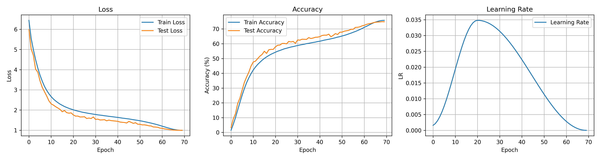
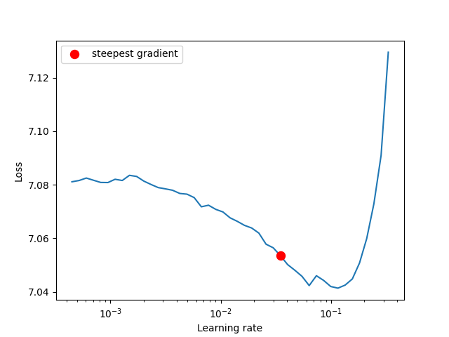

<p align="center">
  
  
  
</p>


# ResNet-50 Training on ImageNet

This repository contains the code for training a ResNet-50 model on the ImageNet dataset. The training was performed using AWS.

## Try it!

You can try the model on Hugging Face Spaces: [ImageNet 1k Classification](https://huggingface.co/spaces/aravindchakravarti/imagenet_1k)

## Training Log

The following table shows the training and validation metrics for each epoch.

| Epoch | Train Loss | Train Accuracy | Test Loss | Test Accuracy | Learning Rate |
|---|---|---|---|---|---|
| 0 | 6.442 | 1.413 | 5.986 | 3.266 | 0.00158 |
| 1 | 5.552 | 5.422 | 5.029 | 9.042 | 0.00213 |
| 2 | 4.988 | 9.926 | 4.708 | 12.644 | 0.00305 |
| 3 | 4.500 | 15.091 | 4.021 | 19.578 | 0.00429 |
| 4 | 4.076 | 20.271 | 3.872 | 23.172 | 0.00585 |
| 5 | 3.726 | 25.157 | 3.440 | 28.598 | 0.00768 |
| 6 | 3.428 | 29.608 | 3.123 | 33.770 | 0.00974 |
| 7 | 3.173 | 33.558 | 2.906 | 37.420 | 0.01200 |
| 8 | 2.972 | 36.843 | 2.694 | 40.694 | 0.01438 |
| 9 | 2.804 | 39.697 | 2.454 | 44.848 | 0.01685 |
| 10 | 2.665 | 42.186 | 2.306 | 47.604 | 0.01934 |
| 11 | 2.547 | 44.219 | 2.244 | 48.220 | 0.02181 |
| 12 | 2.451 | 45.967 | 2.167 | 49.940 | 0.02420 |
| 13 | 2.368 | 47.419 | 2.100 | 51.580 | 0.02645 |
| 14 | 2.293 | 48.836 | 2.031 | 52.756 | 0.02851 |
| 15 | 2.232 | 50.032 | 1.913 | 54.938 | 0.03034 |
| 16 | 2.174 | 51.075 | 1.974 | 53.438 | 0.03190 |
| 17 | 2.127 | 52.013 | 1.869 | 55.902 | 0.03315 |
| 18 | 2.082 | 52.859 | 1.845 | 56.194 | 0.03406 |
| 19 | 2.045 | 53.568 | 1.858 | 56.154 | 0.03461 |
| 20 | 2.010 | 54.255 |.755 | 57.904 | 0.03480 |
| 21 | 1.975 | 54.918 | 1.698 | 58.954 | 0.03476 |
| 22 | 1.947 | 55.432 | 1.701 | 59.092 | 0.03466 |
| 23 | 1.920 | 55.991 | 1.655 | 60.154 | 0.03448 |
| 24 | 1.894 | 56.548 | 1.657 | 60.202 | 0.03423 |
| 25 | 1.873 | 56.936 | 1.666 | 59.910 | 0.03391 |
| 26 | 1.852 | 57.366 | 1.581 | 61.536 | 0.03353 |
| 27 | 1.831 | 57.772 | 1.601 | 61.214 | 0.03308 |
| 28 | 1.814 | 58.068 | 1.581 | 61.528 | 0.03256 |
| 29 | 1.796 | 58.449 | 1.656 | 60.270 | 0.03198 |
| 30 | 1.779 | 58.783 | 1.534 | 62.560 | 0.03134 |
| 31 | 1.760 | 59.118 | 1.550 | 62.416 | 0.03065 |
| 32 | 1.748 | 59.409 | 1.507 | 63.054 | 0.02990 |
| 33 | 1.735 | 59.673 | 1.511 | 62.984 | 0.02910 |
| 34 | 1.716 | 60.049 | 1.521 | 62.936 | 0.02825 |
| 35 | 1.704 | 60.271 | 1.466 | 64.126 | 0.02735 |
| 36 | 1.688 | 60.586 | 1.500 | 63.506 | 0.02642 |
| 37 | 1.674 | 60.867 | 1.475 | 63.880 | 0.02545 |
| 38 | 1.660 | 61.112 | 1.464 | 64.352 | 0.02444 |
| 39 | 1.646 | 61.459 | 1.451 | 64.448 | 0.02341 |
| 40 | 1.634 | 61.707 | 1.440 | 64.798 | 0.02235 |
| 41 | 1.617 | 62.044 | 1.405 | 65.568 | 0.02127 |
| 42 | 1.599 | 62.432 | 1.391 | 65.786 | 0.02018 |
| 43 | 1.587 | 62.713 | 1.383 | 65.770 | 0.01907 |
| 44 | 1.571 | 63.003 | 1.357 | 66.454 | 0.01796 |
| 45 | 1.557 | 63.335 | 1.436 | 64.712 | 0.01684 |
| 46 | 1.540 | 63.652 | 1.390 | 65.636 | 0.01573 |
| 47 | 1.521 | 64.053 | 1.339 | 66.826 | 0.01462 |
| 48 | 1.503 | 64.472 | 1.370 | 66.254 | 0.01353 |
| 49 | 1.488 | 64.780 | 1.297 | 67.792 | 0.01245 |
| 50 | 1.466 | 65.233 | 1.293 | 67.826 | 0.01139 |
| 51 | 1.447 | 65.622 | 1.264 | 68.484 | 0.01036 |
| 52 | 1.425 | 66.090 | 1.265 | 68.756 | 0.00935 |
| 53 | 1.400 | 66.639 | 1.246 | 69.064 | 0.00838 |
| 54 | 1.376 | 67.147 | 1.219 | 69.736 | 0.00744 |
| 55 | 1.352 | 67.737 | 1.210 | 69.770 | 0.00655 |
| 56 | 1.324 | 68.293 | 1.162 | 71.024 | 0.00570 |
| 57 | 1.296 | 68.912 | 1.156 | 71.122 | 0.00490 |
| 58 | 1.266 | 69.590 | 1.143 | 71.406 | 0.00415 |
| 59 | 1.234 | 70.284 | 1.104 | 72.092 | 0.00346 |
| 60 | 1.199 | 71.085 | 1.095 | 72.446 | 0.00282 |
| 61 | 1.167 | 71.779 | 1.065 | 73.076 | 0.00224 |
| 62 | 1.134 | 72.527 | 1.053 | 73.488 | 0.00172 |
| 63 | 1.102 | 73.301 | 1.036 | 73.716 | 0.00127 |
| 64 | 1.071 | 74.013 | 1.021 | 74.218 | 0.00089 |
| 65 | 1.044 | 74.624 | 1.008 | 74.514 | 0.00057 |
| 66 | 1.024 | 75.100 | 1.003 | 74.654 | 0.00032 |
| 67 | 1.007 | 75.509 | 0.998 | 74.742 | 0.00014 |
| 68 | 0.997 | 75.733 | 0.996 | 74.890 | 0.00004 |
| 69 | 0.993 | 75.817 | 0.995 | 74.840 | 0.00000 |

## 📈 Plots


## LR Finder Curve



## Model

*   **Model:** ResNet-50
*   **Dataset:** ImageNet-1k
*   **Framework:** PyTorch

# Details

### How to Download the ImageNet Dataset

Downloading the ImageNet dataset is a significant bottleneck due to its size (around 162GB). Here's how to download it for training on AWS:

*   Spin up a small EC2 instance (e.g., `t2.medium`).
*   Create a 420 GB EBS volume. I haven't optimized IOPS or throughput for this.
*   Download the dataset from Hugging Face: [ILSVRC/imagenet-1k](https://huggingface.co/datasets/ILSVRC/imagenet-1k)

```python
# Format dsik
1. sudo mkfs -t ext4 /dev/xvdf
2. sudo apt update
3. sudo apt install python3.12-venv
4. python3 -m venv ~/venv
5. cd ~
6. source venv/bin/activate
7. pip install --upgrade pip
8. pip install datasets
9. sudo mkdir -p /mnt/data/hf_cache
10. sudo chown -R ubuntu:ubuntu /mnt/data/hf_cache (optional)
11. export HF_TOKEN= <your token>.
12. export HF_HOME="/mnt/data/hf_cache"
13. export HF_DATASETS_CACHE="/mnt/data/hf_cache" 
14. export TRANSFORMERS_CACHE="/mnt/data/hf_cache"
16. dataset = load_dataset("ILSVRC/imagenet-1k", split="validation", cache_dir="/mnt/data/hf_cache")

from datasets import load_dataset
import os

# These will use the env vars you just set
print("Downloading to:", os.environ["HF_DATASETS_CACHE"])

train = load_dataset("imagenet-1k", split="train", num_proc=8)
val = load_dataset("imagenet-1k", split="validation", num_proc=8)

print("Download complete!")
print(f"Files saved in: {os.environ['HF_DATASETS_CACHE']}")


```

### Training

*   Launch a `g4dn.2xlarge` or `g5dn.2xlarge` instance with a PyTorch AMI.
*   Mount the EBS partition.
*   Use `lr_finder` to find the best learning rate.
*   Train using the `OneCycle` policy.

### Weights

The model weights are available at: [Hugging Face Model Weights](https://huggingface.co/spaces/aravindchakravarti/imagenet_1k/tree/main)
